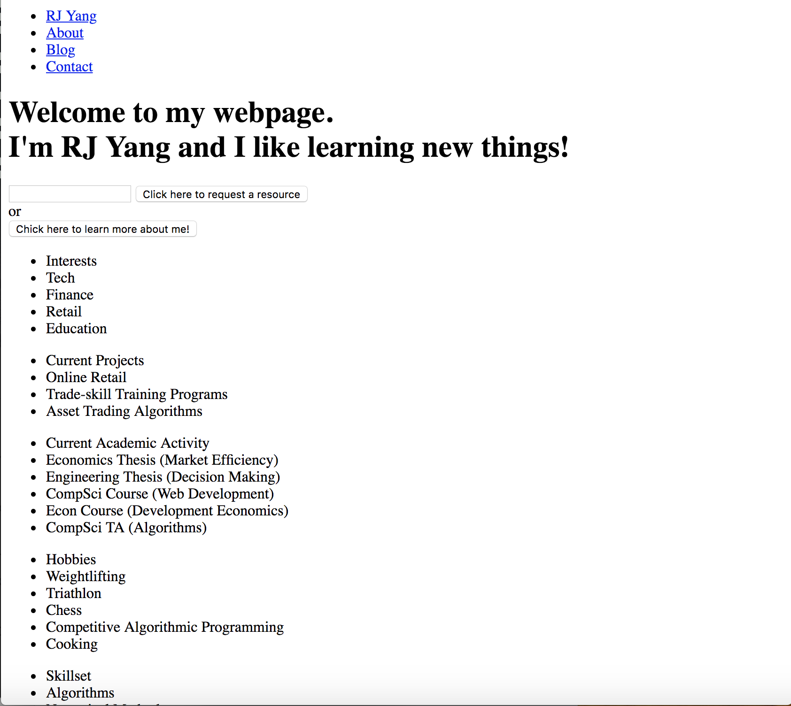
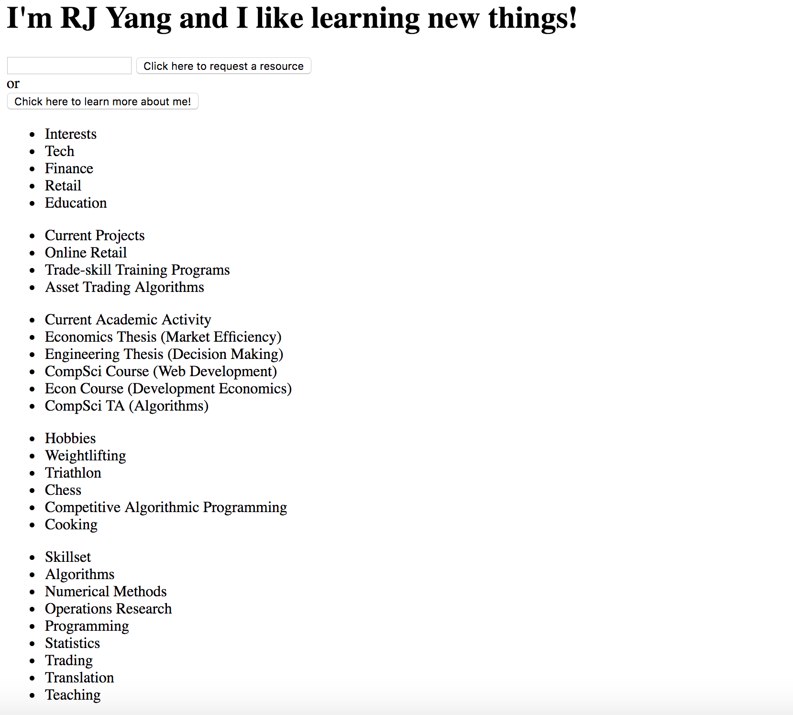
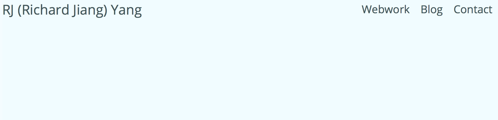
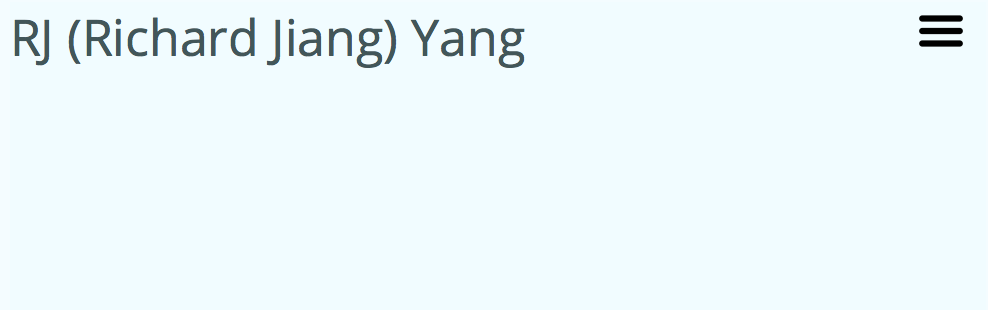
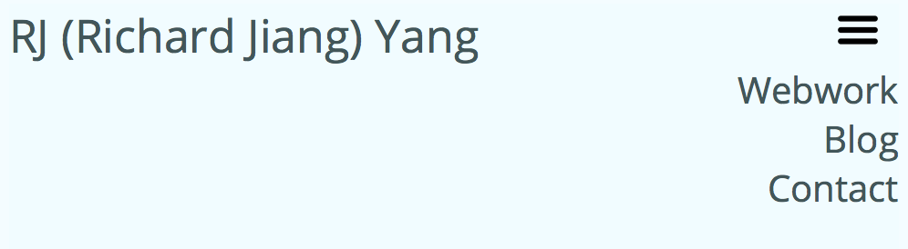
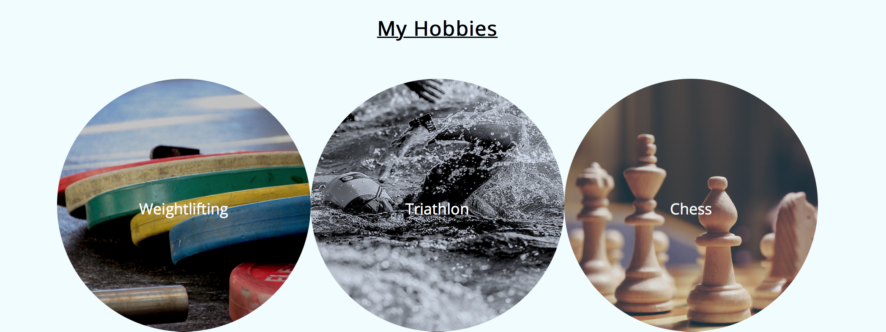
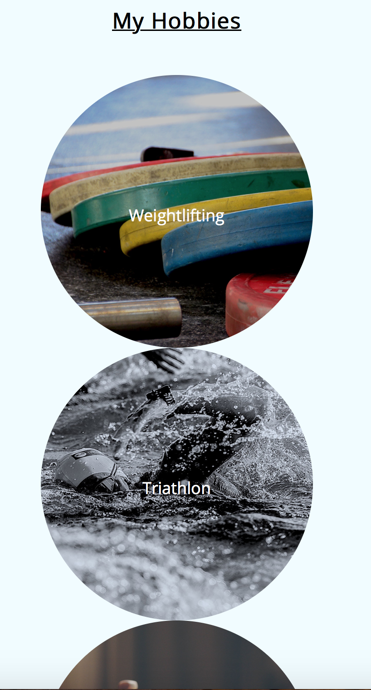

# README for rjyang.me landing page
## April 4th, 2019
url of the original landing page I was mimicking: https://simpleanalytics.io

What I did: I got the general color scheme and layout (especially nav elements) down. I also was able to get the hamburger menu to work for smaller screens. I used some css styling that included hover and checkbox-tricks, and tried to make things look ok at the very least. I believe that my landing page scales well into smaller screens, based on tests that I ran by resizing my browser and opening the page on my phone (although it seems my phone screen does trigger the media max-width conditions).

What didn't work: I couldn't get the hamburger menu to change icons when clicked. I also couldn't get the typing animation from the simpleanalytics.io site to work. Additionally, the background color of simpleanalytics.io changes from blueish to white halfway down the landing page, and I couldn't figure out how to do that effectively either (there always seemed to be a little sliver on the left and side of the browser that didn't do what I wanted with background).

### Screen caps of my layout stage (some elements changed as I styled my site, with some content changing to be more comprehensive or fitting)
##### layout screen cap 1

##### layout screen cap 2

### Screen cap of most notable features (hamburger menu and row to column when screen size shrinks)
#### Regular Nav vs Hamburger Menu when screen size shrinks
##### regular nav menu when screen size is large

##### hamburger nav manu when screen size shrinks

##### pressed hamburger nav menu

#### Row to Column when screen size shrinks
##### Row of pictures when screen size is large

##### Column of pictures when screen size shrinks
