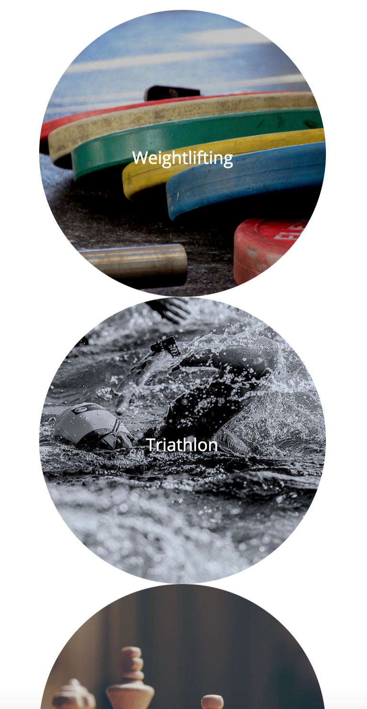
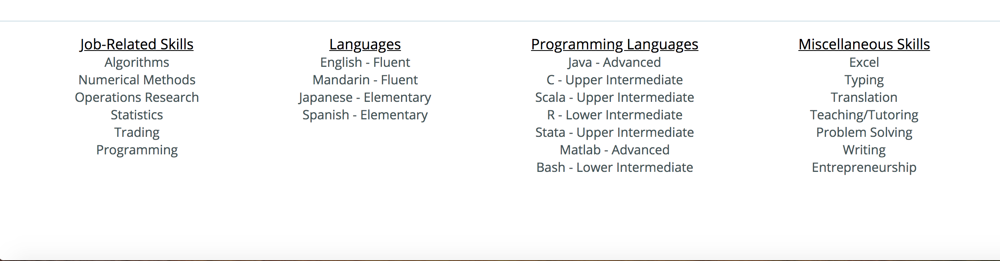
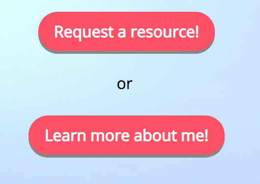

# README for rjyang.me landing page - April 5th, 2019

## 1) URL of the original landing page I was mimicking: 

#### https://simpleanalytics.io

## 2) What I did and didn't do
#### What I did: I got the general color scheme and layout (especially nav elements) down. I also was able to get the hamburger menu to work for smaller screens. I used some css styling that included hover and checkbox-tricks, and tried to make things look presentable. I believe that my landing page scales well into smaller screens, based on tests that I ran by resizing my browser and opening the page on my phone. I also got some cool css transitions to work, especially card flipping effects.

#### What didn't work: I couldn't get the hamburger menu to change icons when clicked. I also couldn't get the typing animation from the simpleanalytics.io site to work.

## 3) Screen caps of my layout stage (some elements changed as I styled my site, with some content changing to be more comprehensive or fitting)
#### layout screen cap 1

#### layout screen cap 2

## 4) Screen cap of most notable features
#### Feature 1: Regular Nav vs Hamburger Menu when screen size shrinks
##### regular nav menu when screen size is large

##### hamburger nav manu when screen size shrinks

##### pressed hamburger nav menu

#### Feature 2: Row to Column when screen size shrinks
##### Row of pictures when screen size is large

##### Column of pictures when screen size shrinks

#### Feature 3: Footer checkbox trick when screen shrinks
##### Footer as row when screen size is large

##### Footer as column of menu items when screen size is large

##### Menu items clicked when footer is column

#### Feature 4: Button hover and pressed effects (look at the "Learn more about me!" button in the following pictures)
##### Button without hover or press

##### Button hover (opacity change)

##### Button pressed (shadow disappear and button moves down as if button is actually clicked)

#### Feature 5: Card Flip (look at the "Chess" card in the following pictures)
##### card without hover

##### card hover mid transition

##### card hover (chess menu does a card flip with animated effect to show information on back)

